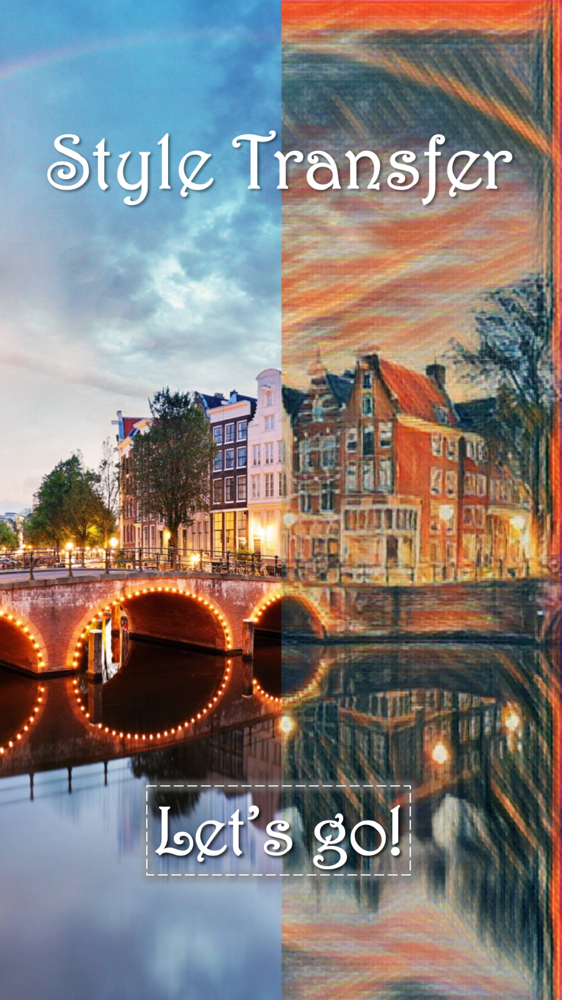

# Android-Style-Transfer

[in Chinese](./README_zh.md)

## Introduction

This project implements the Style Transfer app on the Android platform, which can generate new art work that combines style of one picture with content of another one.

## How to install

- You can download this APP via [BaiduCloud](https://pan.baidu.com/s/1015CjFUm7IxDgTaCmqRLFg) or [OneDrive](https://mailustceducn-my.sharepoint.com/:u:/g/personal/keyanjie_mail_ustc_edu_cn/EffSlFEd0pBIr4K0CF_-7icBIRuTL4RAIhRRhUgmroarAQ?e=pZn3vu)
- Git clone this project and import it into Android Studio, then you can generate an apk file by yourself

## Operating Environment

The following are only recommended configurations, and the minimum configuration has not been tested.

- Operating system: Android 8.0 and above is recommended
- CPU: Qualcomm 845@2.80GHz or Kirin 970@2.80GHz and above
- Storage capacity: 256M or more recommended
- Memory: 4G or more recommended

It is known that insufficient memory will cause OOM errors, and there will be an error under Android 8.0.

## License

This project has applied for computer software copyright, so please don't use it in any business purpose.

## Some Bug Need Be fixed

- When the cover is returned by pressing the `Back` button, the immersive effect of the status bar disappears
- When saving the picture for the first time, you need to authorize the write permission. After giving the permission, you need to click the `download` button again to save it
- The saved image cannot be found in the Huawei image browser, only found in the file system
- Sometimes there are bugs where images saved to the local cannot be shared