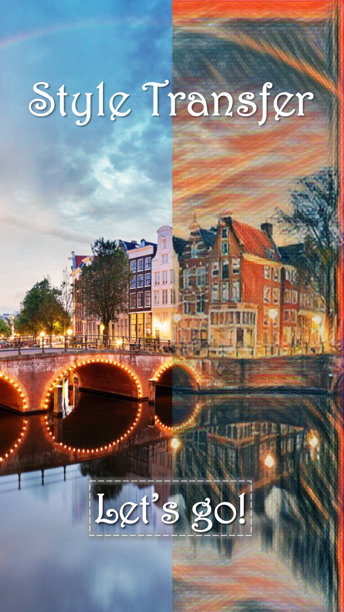

# 风格迁移 - 安卓APP

[in English](./README.md)

## 简介

此项目在安卓平台上实现了风格迁移（Style Transfer）APP，可以把一张图片的风格迁移至另一张图片上，从而生成新的图片。

## 安装方法

- 通过[百度云](https://pan.baidu.com/s/1015CjFUm7IxDgTaCmqRLFg)或者[OneDrive](https://mailustceducn-my.sharepoint.com/:u:/g/personal/keyanjie_mail_ustc_edu_cn/EffSlFEd0pBIr4K0CF_-7icBIRuTL4RAIhRRhUgmroarAQ?e=pZn3vu)下载
- clone此项目，导入到Android Studio中，再打包成apk文件

## 软件运行环境

以下仅为推荐配置，最低配置没有测试过。

- 操作系统：推荐使用Android 8.0及以上
- CPU：推荐Qualcomm845@2.80GHz或麒麟Kirin970@2.80GHz及以上
- 存储容量：推荐256M以上
- 内存：推荐4G以上

已知内存不够会导致OOM错误，操作系统版本低于Android 8.0时会有运行出错的可能。

## 许可

本项目已申请计算机软件著作权，请勿商用。

## 已知bug

- 按`Back`键返回封面时，状态栏的沉浸式效果消失
- 第一次保存图片时，要求授权写权限，给予权限后，还需再点击一次`download`才可以保存
- 保存后的图片在华为图片浏览器里找不到，只有在文件系统里才可以找到
- 有时会出现保存到本地的图片无法分享的bug